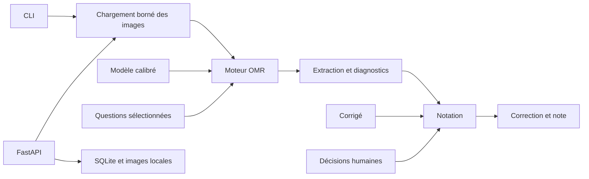

# Architecture actuelle

[Documentation](../README.md) · [Décision fondatrice](decisions/0001-mvp-foundation.md)

PsychoMark est un monolithe modulaire Python avec deux points d'entrée : CLI et HTTP.
Le package est suffisamment petit pour conserver des modules nommés explicitement,
sans déplacer les fichiers dans des sous-packages vides. Une séparation ultérieure
doit résoudre une difficulté observée, avec des imports et tests maintenus.

## Carte du code

| Module | Responsabilité | Frontière à respecter |
|---|---|---|
| [config.py](../../src/psychomark/config.py) | Géométrie, seuils, sélection et validation | Pas de HTTP, SQL ou corrigé |
| [images.py](../../src/psychomark/images.py) | Lecture image/PDF, bornes et normalisation | Pas de décision de notation |
| [calibration.py](../../src/psychomark/calibration.py) | Référence vierge, empreinte et aperçu | Ne prouve pas la validité réelle du modèle |
| [registration.py](../../src/psychomark/registration.py) | Alignement ORB/RANSAC et diagnostics | Rejeter une géométrie non exploitable |
| [engine.py](../../src/psychomark/engine.py) | Lire les marques et annoter | Ne reçoit jamais les bonnes réponses |
| [grading.py](../../src/psychomark/grading.py) | Corrigé, révision et calcul de note | Pas d'analyse des pixels |
| [store.py](../../src/psychomark/store.py) | Transactions, instantanés, révisions et historique | Pas d'interprétation optique |
| [cli.py](../../src/psychomark/cli.py) | Arguments, traitement des lots et exports | Orchestrer les modules existants |
| [web.py](../../src/psychomark/web.py) | Routes, import, erreurs et orchestration | Ne pas dupliquer les règles de notation |
| [static/](../../src/psychomark/static/) | Interface provisoire en français | Afficher la note calculée côté serveur |
| [demo.py](../../src/psychomark/demo.py) | Données synthétiques reproductibles | Ne pas mélanger vérité synthétique et validation terrain |
| [development.py](../../src/psychomark/development.py) | Origine Codespaces et empreinte des sources | Réserver l'actualisation au mode développement |

## Concepts et données

- **Layout** : géométrie des sections. **Template** : géométrie, référence et seuils.
- **Exam** : sélection des questions. **Assessment** : examen avec corrigé complet.
- **Extraction** : réponses et diagnostics optiques ; indépendante de la notation.
- **Review** : décision humaine séparée, réversible, liée à une révision attendue.
- **Grade** : résultat calculé ; une note finale reste absente tant qu'il y a des cas en attente.

SQLite contient `exams`, `copies` et `review_events`. Les copies enregistrent l'examen,
son numéro de révision, la géométrie et l'extraction au moment de l'import. Changer
un corrigé ne réécrit pas les anciennes copies. Les images restent dans le dossier
de données, à côté de la base. Les paramètres SQL sont liés, pas concaténés.

Le schéma SQL est actuellement créé par `Store` avec `CREATE TABLE IF NOT EXISTS`.
**Il n'existe pas encore de système de migrations** : toute première évolution du
schéma persistant devra apporter une migration testée sur une ancienne base.
Une révision d'enregistrement et `schema_version` d'un JSON ne sont pas une migration SQL.

## Limites qui guident les prochaines évolutions

Le serveur garde les moteurs en mémoire et sérialise les traitements optiques avec
un verrou de processus. Il n'existe pas de file de tâches distribuée ; lancer plusieurs
workers n'est pas une solution validée. L'application n'a ni comptes ni organismes.
Les sorties optiques restent en partie des dictionnaires : un typage exhaustif n'est
pas en place. La prochaine extraction de modèles typés devra préserver les exports.

Voir [API](api.md), [limites OMR](omr.md), [données](../development/data.md) et
[priorités](../product/roadmap.md).
