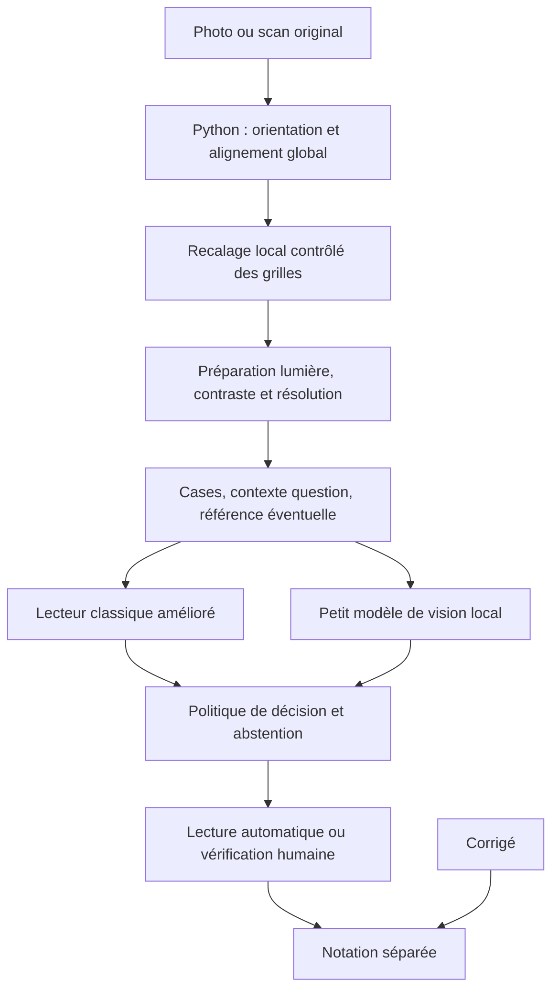

# Plan de développement — OMR hybride robuste aux photographies

Date utilisateur : 2026-10-08. État : **S01 et outillage S02 implémentés ; collecte et lots suivants à réaliser**.

[Priorités](roadmap.md) · [Architecture actuelle](../architecture/overview.md) ·
[ADR proposé](../architecture/decisions/0004-hybrid-omr-experiment.md) ·
[État courant](../memory/current.md)

## 1. Objectif et point de départ

Construire un lecteur qui utilise Python/OpenCV pour préparer et localiser les zones,
puis un lecteur classique et un petit modèle de vision pour interpréter les marques.
La décision finale conserve la possibilité de s’abstenir ; le corrigé ne sert qu’à
la notation, après la lecture. L’objectif est de réduire les corrections manuelles
sans augmenter les réponses faussement certaines.

Le dépôt contient déjà le moteur, la calibration, l’assistant de feuilles, les essais,
les diagnostics, les examens, la correction humaine et les exports. Le plan s’appuie
sur ces composants. Il ne requiert ni refonte graphique, ni nouveau SaaS, ni nouvelle
base de données pour démarrer.

Un diagnostic réel est disponible localement hors Git. L’alignement global réussit,
mais résolution/cadres provoquent un refus. Relâcher ces contrôles dans une expérience
privée donne des lectures incertaines. **L’utilisateur confirme qu’il s’agit de la même
feuille photographiée.** Une différence de couleur ou de rendu ne prouve pas une variante
de document ; la déduction antérieure sur une différence d’impression n’est pas établie.

Ce cas est déjà un cas de développement connu : il ne pourra pas constituer à lui seul
le test final indépendant. Il suffit pour commencer les outils et les expériences,
mais pas pour annoncer une précision générale. Aucun CNN n’est actuellement installé
ou entraîné. La normalisation locale de l’éclairage existe déjà : mesurer et améliorer
`images.normalized_gray` avant d’empiler de nouvelles corrections.

## 2. Chaîne cible et frontières

- La géométrie appartient à Python. Un modèle visuel ne décide pas du numéro de la
  question à partir d’une position supposée ; les identifiants viennent du modèle de feuille.
- Chaque lecteur reçoit les images et leurs informations de qualité, jamais la bonne
  réponse, la note, l’identité de l’élève ou des indices de correction pédagogique.
- Les états publics restent `single`, `blank`, `multiple`, `uncertain`, `unreadable`.
  Une règle de décision indépendante transforme observations et scores en ces états.
- Une mauvaise géométrie peut arrêter la lecture même si un classifieur affiche un
  score élevé. Les scores bruts ne sont pas des probabilités de justesse validées.
- Une feuille ajoutée par l’utilisateur peut être calibrée sans être dans le domaine
  de validation du modèle ML. La prise en charge déclarée doit rester explicite.

Avant des travaux parallèles, fixer un contrat de régions contenant les identifiants,
les coordonnées dans la source et la référence, les transformations composées, les
masques de pixels disponibles, les tailles dans l’image d’origine et les motifs de refus.
Le contrat de lecture contient les observations, les candidats, la décision et la
provenance : version du moteur, prétraitement, modèle/empreinte et politique de décision.
Ne pas exposer les bonnes réponses dans ces contrats, même dans les exemples d’entraînement.

## 3. Sessions de livraison

Une session est un lot cohérent et vérifiable, pas une durée de conversation garantie.
Une session complexe peut nécessiter plusieurs tours ou plusieurs PR. Le tableau donne
l’ordre et les dépendances ; les critères de passage priment sur un calendrier artificiel.
S01 est implémenté : [outil et limites](../development/omr-baseline.md),
[contrats](../architecture/regions.md). Les autres lots restent **à implémenter**.
L’annotation humaine du cas réel n’est pas encore validée.

| Lot | Travail et résultat concret | Dépendance | Critère de passage |
|---|---|---|---|
| S01 — Référence de comparaison et contrats | Figer le comportement historique, rejouer un diagnostic, définir régions/observations/provenance et protocole de mesure | Aucune | Rapport reproductible du cas disponible et des fixtures ; association question/choix vérifiable ; contrats relus |
| S02 — Corpus et annotation | Manifeste privé, identifiants de feuilles physiques, petit parcours d’annotation avec cases et question entière, labels révisables | Contrats S01 | Une annotation humaine complète peut être créée/reprise/exportée ; doublons et groupes de séparation contrôlés |
| S03 — Recalage local | Corriger les résidus d’alignement par grille à partir des éléments imprimés | S01, régions de référence | Déplacements bornés, correspondances contrôlées, masque valide et projection inverse corrects ; refus des mauvaises grilles |
| S04 — Compensation photographique | Comparer variantes de normalisation, couleur, contraste et rapprochement de netteté/résolution | S01 ; stabilisation avec S03 | Rapport isolant le gain de chaque variante et les régressions ; marques faibles préservées ; original conservé |
| S05 — Lecteur classique renforcé | Caractéristiques des marques et comparaison entre choix ; remplacer progressivement la simple soustraction fragile | S03/S04, annotations exploratoires S02 | Rapport par type de défaut ; aucune règle imposant un gagnant ; comportement des blancs/multiples/traces contrôlé |
| S06 — Prototype ML spécialisé | Entraînement reproductible d’un CNN compact, lecture des cases et essai du contexte question/référence, inférence locale CPU | Contrat S01, premiers exemples S02 ; prototype possible pendant S03/S04 | Entraînement/inférence reproductibles, modèle exportable et comparaison avec le classique ; prétraitement figé avant évaluation finale |
| S07 — Décision et calibration des scores | Comparer classique, ML et combinaison ; établir abstention, seuils et périmètre | S05/S06 et données de développement/calibration séparées | Courbes erreur/couverture, motifs lisibles, seuils choisis sans consulter le test final ; garde-fous géométriques conservés |
| S08 — Observation dans l’application | Calculer les nouvelles lectures à côté de l’ancienne, afficher les désaccords et conserver les versions | Contrats stables ; candidats S05/S06, politique S07 pour verdicts comparés | Pas d’effet des candidats sur les notes ; compatibilité CLI/web/assistant/exports ; ancien historique intact |
| S09 — Évaluation indépendante et activation limitée | Tester le candidat figé sur des copies réservées ; activer seulement sur le périmètre validé | S07/S08 + test final indépendant suffisant | Critères de risque, couverture et exploitation satisfaits avec incertitude documentée ; retour arrière testé ; sinon rester en observation |
| S10 — Pilote et amélioration suivie | Mesurer le temps réellement économisé, les erreurs et les nouveaux cas ; réentraîner en versions séparées | S09 ou pilote explicitement assisté humainement | Rapport d’usage, suivi par appareil/feuille, nouvelle version évaluée avant remplacement ; pas d’apprentissage automatique silencieux |

### S01 : référence de comparaison livrée

Créer une commande de comparaison exécutée par Codex, avec configuration enregistrée,
qui rejoue le moteur historique sur les données disponibles et produit un rapport privé.
Recenser aussi tous les consommateurs du JSON existant : CLI, notation, assistant,
images/crops, exports et instantanés SQLite. Définir le schéma de régions et les mesures.

Préparer les crops des 90 questions du diagnostic connu pour une annotation visuelle,
sans introduire de corrigé dans le moteur. Vérifier les positions indépendamment des
lectures automatiques. Les suggestions de Codex peuvent préparer le travail ; elles
ne remplacent pas une validation humaine, en particulier sur les traces ambiguës.
Livrable de session : rapport initial, contrats, tests de correspondance et lot d’annotation.

État livré : outil offline, rapport local de 90 questions du diagnostic, extraction
inchangée, géométrie/masques/provenance et annotations laissées vides. Les correspondances
sont testées sur synthétique ; un contrôle visuel exploratoire ne valide pas l’ensemble
des positions ni les réponses de la photo. L’annotation est maintenant disponible dans S02.

### S02 : outillage d’annotation livré

L’espace **Annotations** importe images/PDF ou diagnostics et conserve observations,
révisions, provenance et groupes privés. Un échec d’alignement permet une annotation
sur source et un cadre manuel de question, sans inventer de coordonnées validées par
case. Les doublons de pixels et les usages incohérents d’un groupe sont refusés.
Voir [le guide](../guides/annotations.md) et [ADR 0005](../architecture/decisions/0005-private-annotation-corpus.md).

Le parcours création/reprise/export est vérifié sur synthétique. Les deux diagnostics
connus ont été importés en développement, sans autorisation d’entraînement et sans
labels humains inventés. La collecte d’observations réelles, une seconde lecture
indépendante et le jeu réservé restent à constituer. Les photos proches doivent être
regroupées par l’opérateur ; aucun détecteur de quasi-doublons n’est installé.

### S03/S04 : améliorer les images sans fabriquer de marques

L’alignement global demeure le premier repère. Tester ensuite des corrections locales
bornées par les cadres et l’impression stable, puis éventuellement par question si
les mesures le justifient. Ne pas déplacer les zones vers les taches les plus sombres
ni utiliser les réponses comme repères géométriques. Dans une grille répétitive, un
mauvais ajustement peut déplacer toute une lecture d’une question : ce défaut doit être testé.

Conserver les coordonnées source, composer les transformations autant que possible
et limiter les rééchantillonnages successifs. L’aperçu et les extraits de vérification
doivent montrer exactement les zones lues, y compris après correction locale.

Comparer séparément normalisation d’éclairage, contraste, traitement couleur et
adaptation de netteté de la référence. Ne pas supprimer aveuglément une couleur :
un trait d’élève pourrait l’utiliser. Pas de super-résolution générative fabriquant
du détail ; l’agrandissement technique ne change pas le nombre de pixels disponibles
à l’origine. Les paramètres seront choisis par comparaison, pas parce qu’ils améliorent
visuellement une seule image.

### S05/S06 : deux lecteurs mesurables

Le classique combine couverture d’encre, contraste local, continuité et disposition
des traits, puis compare les choix. Il constitue un point de comparaison utile même
si le modèle ML devient finalement le lecteur principal.

Pour le ML, commencer par un seul petit CNN partagé entre cases, avec conservation
du rapport de forme et information sur la qualité source. Tester ensuite l’apport
du contexte question et de la référence correspondante. Ne pas lancer d’emblée trois
architectures complexes. Les contrats conservent les 2 à 10 choix possibles de la
configuration actuelle ; ne pas coder implicitement quatre choix partout. Si le
premier modèle est validé uniquement sur quatre choix, son activation doit le préciser.

Le modèle prédit des observations visuelles : vide, marque visible, trace ambiguë,
zone inexploitable. Une forme « cochée » ou « remplie » peut devenir un attribut si les
exemples le permettent. « Effacée » décrit au mieux une trace visible ; aucune étiquette
ne doit inventer l’intention passée de l’élève. La décision unique/multiple se prend
au niveau de la question en préservant les candidats.

Choix technique de départ proposé : PyTorch pour les expériences d’entraînement,
avec une dépendance optionnelle verrouillée au moment de S06. L’exécution CPU locale
est la cible initiale. Un export ONNX/ONNX Runtime est une option à mesurer, pas une
nouvelle stack déjà décidée ou installée. GPU ponctuel seulement si les durées CPU
le justifient ; son absence n’empêche pas S01–S05. Pas de service ML distant obligatoire.

## 4. Données, annotations et séparation des usages

Le manifeste doit associer original, référence, feuille physique, acquisition,
version du modèle de feuille, conditions connues, annotations et empreintes des fichiers.
Pas de noms d’élèves dans les identifiants techniques. Les images, annotations réelles,
poids et rapports détaillés restent privés et sont sauvegardés hors du dépôt Git.
Des données d’entraînement doivent être autorisées pour cet usage ; ne pas assimiler
l’envoi d’un diagnostic ponctuel à un consentement à une collecte générale.

Planifier un premier lot exploratoire de quelques dizaines de feuilles physiques
variées, si accessibles, sans en faire un minimum obligatoire pour développer les outils
ni un effectif suffisant pour promettre une précision. Des milliers de crops issus
d’une seule photo ne constituent pas des milliers d’acquisitions indépendantes.
Le volume supplémentaire dépendra des erreurs, des cas rares et du périmètre visé.

Couvrir : blancs, remplissages, coches, croix, marques multiples, traces faibles,
effacements visibles, ombres, papier courbé, perspective, compression, mises au point
et impressions variées. Les annotations portent sur les marques visibles et la
réponse lisible, **pas sur la bonne réponse à l’examen**. Une absence est différente
d’une impossibilité de trancher. Éviter de montrer la prédiction au premier annotateur
du jeu d’évaluation. Prévoir une seconde lecture des cas ambigus et d’un échantillon ;
si un seul annotateur est disponible, déclarer cette limite.

Séparer les données par feuille physique avant toute augmentation : toutes ses
photos, recadrages et versions transformées restent dans le même groupe. Regrouper
également par scripteur et session de capture quand c’est possible. Rechercher les
doublons ; tester séparément les appareils et modèles de feuille inconnus si leur
prise en charge est revendiquée.

- **Apprentissage** : exemples utilisés pour ajuster les poids.
- **Développement** : exemples pour choisir les méthodes et réglages.
- **Calibration** : exemples réservés pour ajuster scores et seuils de décision.
- **Test final** : exemples réservés pour évaluer la version figée.

Si le corpus ne permet pas ces groupes, utiliser une validation croisée groupée
exploratoire et annoncer qu’aucune preuve indépendante suffisante n’existe encore.
Ne pas contourner le manque de données en séparant aléatoirement les cases d’une page.
Après modification motivée par les résultats d’un test final, celui-ci devient un
jeu de développement ; il faut de nouvelles données indépendantes pour réévaluer.

Les exemples synthétiques permettent de vérifier le code et de démarrer un prototype.
Les augmentations d’entraînement simulent seulement des variations plausibles et
préservent les labels : une image rendue illisible ne garde pas artificiellement une
réponse certaine. Les tests de non-régression peuvent contenir des dégradations fixes,
séparées des augmentations utilisées pour apprendre.

## 5. Mesures et conditions de passage

La sélection du modèle regarde d’abord les erreurs silencieuses, puis le travail
économisé. Un modèle qui rejette tout n’est pas utile ; un modèle qui remplit tout
avec assurance n’est pas nécessairement fiable.

Définir `Q` = toutes les questions attendues, y compris sur les pages refusées,
`A` = décisions acceptées automatiquement, `E` = décisions automatiques incorrectes
ou déclarées certaines alors que la référence humaine est indéterminable.

| Mesure | Définition / usage |
|---|---|
| Erreur parmi les décisions automatiques | `E/A` ; non définie lorsque `A=0`, jamais annoncée comme 0 % |
| Couverture automatique | `A/Q`, avec les questions de pages refusées dans le dénominateur |
| Révision et rejet | Questions à examiner / `Q` ; pages refusées / pages soumises |
| Copies entièrement automatiques et exactes | Pages intégralement correctes sans revue / pages soumises |
| Erreurs de localisation | Mauvaise question/option, décalage de grille ; distinctes de la classification des marques |
| Charge de travail | Temps de revue par copie et nombre de décisions humaines |
| Exploitation | Latences médiane et haute, mémoire et coût réel de traitement |

Afficher effectifs de feuilles et questions, résultats par type de défaut, modèle de
feuille et acquisition. Les questions d’une page sont corrélées : les intervalles
d’incertitude doivent tenir compte des groupes, par exemple via rééchantillonnage par
feuille lorsque l’effectif le permet. Une seule copie ne permet pas une estimation
robuste. Zéro erreur sur un petit lot ne démontre pas un objectif commercial.

Avant le test final, l’intégrateur et le responsable produit consignent dans le
protocole : risque maximal toléré, couverture minimale utile, cas nécessitant toujours
une revue, limites de temps/mémoire et périmètre de feuilles/captures. Ces cibles restent
à fixer sur des exemples concrets et le coût des erreurs ; aucun pourcentage arbitraire
n’est promis ici. Ce choix ne bloque pas le démarrage des travaux exploratoires.

Une seule modification optique à la fois est comparée au point de départ. Comparer
classique seul, ML seul et combinaison ; le système hybride ne doit pas être retenu
seulement parce qu’il est plus complexe. Les scores du modèle doivent être calibrés
sur des données réservées. Un désaccord clair entre lecteurs peut provoquer une revue ;
il ne faut pas exiger systématiquement l’accord du classique si celui-ci s’abstient
sur toutes les photos. La politique retenue doit être justifiée par les mesures.

## 6. Organisation des agents Codex

Un **agent principal d’intégration** conserve la vision du produit, le contrat de données,
le plan, les arbitrages, les tests complets et la livraison. Il effectue les opérations
accessibles, puis explique ce qui a changé et ce qui demande réellement une intervention.
Les agents spécialisés reçoivent des missions limitées avec un livrable vérifiable.

| Rôle | Responsabilité | Propriété de fichiers indicative, à fixer au début du lot |
|---|---|---|
| Intégrateur | Contrats, dépendances, décisions, commits, branche et documentation courante | `config.py`, orchestration, manifestes/verrous, mémoire |
| Géométrie | Recalage global/local, transformations et qualité des régions | `registration.py`, futurs modules de régions, tests géométriques |
| Lecture / ML | Prétraitement et lecteurs ; les sous-lots se font successivement si les fichiers se recouvrent | Futurs modules de lecture et entraînement, tests associés |
| Données / évaluation | Manifeste, annotation, séparation des groupes et rapports comparatifs | Futurs outils d’évaluation, tests de protocole ; données réelles hors Git |
| Relecteur | Critique du diff, tests ciblés indépendants, recherche de fuite et régression | Lecture seule par défaut ; corrections attribuées ensuite à leur propriétaire |

Ne pas garder cinq agents actifs en permanence. Commencer avec l’intégrateur et un
agent spécialisé ; passer à deux spécialistes en parallèle seulement sur des périmètres
indépendants. Les rôles peuvent être tenus successivement par le même agent.

Ordre recommandé :

1. **S01 ensemble** : l’intégrateur fixe les contrats avec une revue indépendante.
2. **S02 et S03 en parallèle** : données/annotation et géométrie ; S04 peut faire l’objet
   d’une expérience indépendante, puis d’une intégration contrôlée.
3. **S05 et S06 en parallèle** après disponibilité des crops contractuels : lecteur
   classique et ML. Le prétraitement est versionné ; une évolution impose de réévaluer
   les modèles qui l’utilisent. Éviter que chaque agent implémente son propre prétraitement.
4. **S07 intégré**, avec revue indépendante ; S08 peut préparer l’affichage sur des
   sorties synthétiques contractuelles pendant la stabilisation, pas activer les notes.
5. **S09/S10 séquentiels pour les décisions de livraison**, même si les mesures et la
   revue peuvent être réparties.

Dans une session Codex, les sous-agents partagent ici le même checkout : pas de branches,
commits, changements de dépendances ou modifications des mêmes fichiers en concurrence.
L’intégrateur garde ces opérations. Définir l’autorisation d’écriture par fichiers et
un format de retour : résultat, fichiers modifiés, tests, limites, point de reprise.
Ne pas exécuter des tests de démarrage/rechargement qui modifient temporairement les
sources en même temps que d’autres validations utilisant ces sources.

Pour plusieurs discussions Codex indépendantes, chacune travaille sur une branche
explicite de son environnement et un périmètre fixé. Publier les changements avant
qu’un autre environnement les récupère ; le chat, Codex cloud et Codespaces ne sont
pas une mémoire partagée en direct. Pas de worktree créé automatiquement. Fusionner
les dépendances avant de démarrer un lot qui en dépend.

## 7. Structure documentaire et technique

Ce document est la feuille de route détaillée ; `roadmap.md` reste l’index des priorités,
`current.md` indique le lot actif et le prochain geste concret, les sessions consignent
les résultats. Les décisions durables vont dans un ADR. Ne pas créer une seconde mémoire
par agent qui concurrencerait l’état courant.

Créer les modules seulement au moment de leur utilisation. Emplacements proposés :

- modules de préparation/régions/lecteurs sous `src/psychomark/`, sans déplacer inutilement
  le moteur existant ; conserver `grading.py` indépendant ;
- scripts d’évaluation et d’entraînement dans des dossiers clairement nommés, avec des
  commandes documentées dans l’outillage de développement ;
- configurations et fixtures synthétiques dans Git ; originaux, annotations réelles,
  checkpoints et rapports privés sous `artifacts/private/` puis sauvegarde privée explicite ;
- manifeste de chaque entraînement : version des données/splits, code, graine, configuration,
  prétraitement, poids/empreinte, provenance et métriques. Un chemin local ne suffit pas à
  garantir qu’une nouvelle session retrouve les mêmes données.

La gestion actuelle des modèles de feuille est stricte (`schema_version=1`, champs
inconnus refusés). Versionner explicitement toute évolution de ces fichiers et tester
la lecture des anciens modèles. Pour les extractions, préserver les champs utilisés
par la CLI, l’UI et la notation. Ajouter la provenance de manière compatible ; une
réanalyse crée un nouvel enregistrement, jamais une modification des anciennes copies.
Toute nouvelle colonne SQLite exige une migration réelle et une restauration testée.

## 8. Activation, environnement et retour arrière

Le mode observation calcule les candidats à côté du moteur courant, sans effet sur les
notes. Les exemples destinés à l’évaluation aveugle restent séparés de cet affichage.
Une version candidate ne devient active que dans le périmètre annoncé après S09.

Prévoir modes explicites historique/observation/hybride, sélection versionnée du modèle,
empreinte des poids et contrat de prétraitement. Un modèle absent ou incompatible donne
un diagnostic clair ; tout recours au moteur historique est explicite et tracé. Un score
ML élevé n’annule pas une erreur d’identification ou un cadrage inexploitable.

Tester le retour au moteur historique sur les futurs imports, sans modifier les notes
ni extractions passées. Les corrections humaines restent séparées et historisées.
Une rétroaction utilisateur peut enrichir un futur corpus après validation ; elle ne
réentraîne pas automatiquement le modèle actif.

L’environnement actuel suffit aux premiers lots. Ajouter les dépendances ML via le
manifeste et `uv.lock` lors du lot concerné, vérifier l’installation gelée, puis documenter
le démarrage. Le web courant doit rester utilisable sans entraînement ni téléchargement
implicite de poids. Une demande de GPU, stockage externe ou service payant n’intervient
que sur un besoin mesuré, avec coût et transfert de données explicités avant utilisation.

## 9. Mode d’emploi des prochaines sessions

L’intégrateur doit, sans demander à l’utilisateur d’exécuter les scripts accessibles :

1. lire AGENTS, l’état courant et ce plan ; recouper branche, commit, modifications et données disponibles ;
2. choisir le lot actif, vérifier les dépendances, annoncer le livrable et les limites ;
3. attribuer les tâches/fichiers aux agents seulement si le parallélisme est utile ;
4. implémenter puis mesurer ; comparer à la référence et relire les erreurs ;
5. exécuter `scripts/dev.py check`, le parcours navigateur pour l’UI, `live` pour le démarrage,
   et l’évaluation optique pertinente ; une suite synthétique verte ne remplace pas cette dernière ;
6. publier une branche/PR lorsque possible, mettre à jour session, état courant et plan ;
7. rendre un bilan concret : ce qui marche, preuves, limites et prochain lot.

Message de reprise facultatif, pas une commande à exécuter maintenant :

> Reprends PsychoMark. Lis AGENTS.md, docs/memory/current.md et le plan OMR hybride.
> Vérifie l’état réel du dépôt. Travaille uniquement sur le prochain lot prêt, avec
> les agents utiles et des périmètres de fichiers distincts. Exécute les tests,
> conserve les données privées hors Git et documente la livraison. Ne démarre pas
> une activation ML automatique sans les preuves prévues au plan.

L’utilisateur dirige les choix métier et visuels, fournit progressivement des copies
utilisables pour l’apprentissage/évaluation et valide les annotations difficiles.
Codex prépare les outils, les expériences, les dépendances nécessaires et les livraisons.
Il n’y a aucune commande ni collecte massive à effectuer pour approuver ce plan.
